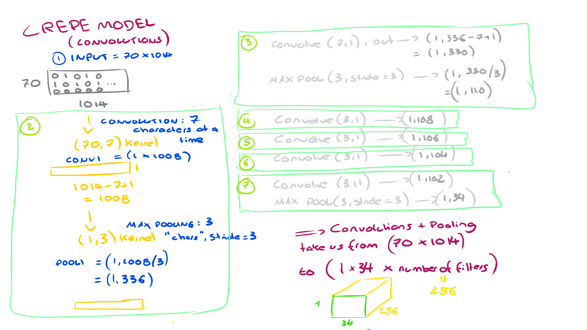

# Deep Learning - Sentiment Analysis using MXNet

## Results

02 - Crepe - Amazon.ipynb:
```
Accuracy: 0.942
Time per Epoch: 9,550 seconds = 220 rev/s
Total time: 9550*10 = 1592 min = 26.5 hours
Train size = 2,097,152
Test size = 233,016
```

03 - Crepe - Dbpedia.ipynb:
```
Accuracy: 0.991
Time per Epoch: 3,403 seconds = 170 rev/s
Total time: 33883 seconds = 564 min = 9.5 hours
Train size = 560,000 
Test size = 70,000
```

04 - Crepe - Amazon (advc).ipynb (generator + async):
```
Accuracy: 0.945
Time per Epoch: 21,629 = 166 rev/s
Total time: 21,629 * 10 = 3604 min = 60 hours
Train size = 3.6M
Test size = 400k
```

05 - VDCNN - Amazon.ipynb:
``
# Trying to create the final k-max pooling layer ...
class KMaxPooling(mx.operator.CustomOp):
    def forward(self, is_train, req, in_data, out_data, aux):
        # Desired (k=3):
        # in_data = np.array([1, 2, 4, 10, 5, 3])
        # out_data = [4, 10, 5]
        x = in_data[0].asnumpy()
        idx = x.argsort()[-k:]
        idx.sort(axis=0)
        y = x[idx]
``

## LeNet - MNIST

This notebook walks through different ways of creating and fitting a CNN - ranging from high-level APIs to low-level APIs which give more control over various parameters of the model, along with stuff like custom generators that read from disk, etc.

This is not a sentiment analysis task but it goes over the mnist frameworks we use for sentiment analysis

## Sentiment Analysis - CREPE model

The first convolutional block of the crepe model uses a kernel of size (dim(vocab), 7), perhaps because the average word is 7 characters - this creates a layer wich contains 1018 representations of 'words' (linked by a sliding window of 7 characters) and so the next max-pooling layer with a kernel of (1, 3) and a stride of (1, 3) can be loosely interpreted as a trigram approach. After this we see various layers to perform analysis at greater levels of aggregation (to introduce wider context) before we output with a standard softmax layer.


We use a char-level CNN to classify amazon reviews, called the [Crepe model](https://github.com/zhangxiangxiao/Crepe) and attempt to improve upon the non-deep-learning methods earlier to replicate [Ziang's accuracy of 94.50% (100% - 5.50%)](http://arxiv.org/abs/1509.01626)

```Xiang Zhang, Junbo Zhao, Yann LeCun. Character-level Convolutional Networks for Text Classification. Advances in Neural Information Processing Systems 28 (NIPS 2015)```

## Description:

The below diagrams illustrate how we extend the traditional LeNet CNN applied to MNIST to characters:



